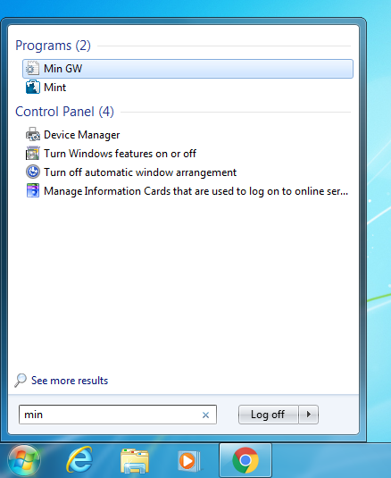
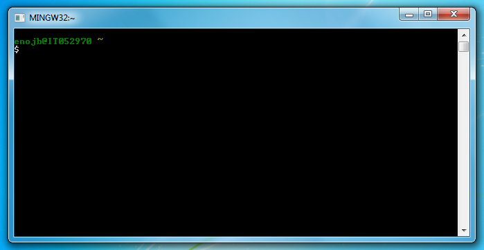
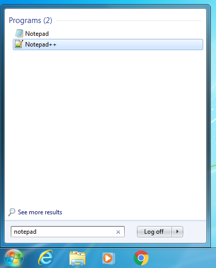

Getting started
===============

Outline
-------

We want to write, compile and run our first C program. There are a few steps
to accomplish this. First we will make a very simple program whose only
purpose is to print the text "Hello world!". Making such a program is a
long-standing tradition in teaching programming languages dating back to the
first textbook for C in 1978. There are good reasons for doing this. There is
quite a lot that a programmer will need to understand just to make the
simplest of programs. It's important to learn this on a program that is
trivially easy before we try to move on to actually doing anything clever in
our programs.

There are three steps to making a C program:

 * Write the C code
 * Compile the code
 * Run the program

Initially you will make mistakes in all three of these steps so we will focus on
the second and third parts for now and keep the C code simple.

Hello world in Python
---------------------

First things first: how would we make a hello world program in Python? Well in
Python we print things using the `print` function. So our program just looks
like:

~~~~~~~ python
# Print a greeting message
print("Hello world!")
~~~~~~~

All we need to do is write that code in a text editor and then save it as
`hello.py` and then we're in business! Now I'm assuming that you already know
of some way to run the `hello.py` program that we've just created. However I
specifically want you to run it from the terminal so that's what we're going
to look at next. Firstly though create the `hello.py` program with the code
shown above and save it as `hello.py` and remember what folder you've saved it
in. It's very important to remember what folder it is in, and what folder that
folder is in and so on. You need to know the full path to the file from the
drive letter e.g.:

    C:\Users\Dave\Unistuff\EMAT10006\Week1\hello.py

The terminal
------------

It's now time to introduce the terminal. Windows comes with a terminal but
it's inconsistent with the terminals on most other computers. We want to use a
terminal that behaves the same as terminals on OSX/Linux etc. so we will be
using the MinGW Shell. For those interested this is an example of a `bash`
shell however the details are not important. What matters is how to start the
shell on the Windows machines in the computer lab. First click on the start
menu and type "min" as shown here:



Now click on the "Min GW" item at the top (or just push enter). This should
open the MinGW terminal which then looks something like this:



The MinGW Shell is an example of a *terminal*. This is an interface where you
type commands and then hit enter to run the command. Then the command will
usually (but not always) print some output that you will see below the command
that you typed. You can then type another command.

One thing to note is the text `enojb@IT052970 ~`. This means that I am logged
in as user `enojb` on the computer whose name is `IT052970` and I am currently
in the directory called `~`. The directory `~` is shorthand meaning my user
directory. Your user directory is the particular folder for your user account.
On this particular machine it will probably be `C:\Users\enojb`. However the
way that the Windows machines in the University are set up is a little
strange. You always have two user directories: one on the `C:\` drive at e.g.
`C:\Users\enojb` (if `enojb` was your username) and one on the `O:\` drive at
`O:\`. The user directory on the `C:\` drive is saved on the *specific*
computer you are logged into. The `O:\` drive is a networked drive: the files
you save there will be accessible on all of the University's computers. I
recommend to always save your work onto the `O:\` drive so that it doesn't get
lost.

Finally notice the `$` symbol in the terminal. This is called the *prompt*.
Any command that you type will appear after the prompt. I don't want to use
lots and lots of screenshots to demonstrate terminal commands so I'm going to
format such terminal sessions like this:

~~~~~~~
$ ls
bin      Desktop    Pictures  src     tmp
current  Documents  Music     Public  Videos
~~~~~~~

To interpret the console session shown above the line beginning with a `$`
shows the command that I typed in the terminal `ls`. The `ls` command is a
special terminal command that means *list* the contents of the current
directory. In this case the directory is my user directory and it shows all of
the folders that are contained within it. To run the `ls` command you would
type `l`, then `s` and then push the `enter` key (try it!). After you hit
enter the terminal will run the `ls` command and the `ls` command will print
out a list of the files and folders in the current directory: this appears on
the second and third lines (`bin`, `Desktop` etc.).

The first two commands we want to learn in addition to `ls` are `pwd` and
`cd`. The `pwd` command is short for *print working directory* and will print
out the current working directory. This is the folder that you are currently
working in. The `cd` command is short for *change directory* and is used to
change to a new working directory. You can then use `ls` to see what is in the
new working directory:

~~~~~~~~
$ pwd
/users/enojb
$ cd current/emat10006web
$ ls
html  Makefile  src
$ pwd
/users/enojb/current/emat10006web
~~~~~~~~

In the session above I use `pwd` to show that I am currently in the directory
`/users/enojb` (this is the name of my user directory on this computer).
Within my user directory is a folder called `current` which contains things I
am currently working on. In there is a folder called `emat10006web` which
contains the files used for working on this unit. If I want to work in that
directory I can change to it by typing `cd current/emat10006web`. Afterwards
my current working directory is `/users/enojb/current/emat10006web` and if I
run `ls` it will show me the contents of this new directory.

Running Python from the terminal
--------------------------------

To run a Python script we need to first write the code and save it in a file
called e.g. `hello.py` as explained [above](#hello-world-in-python). I've
already done this and I saved in a folder called `current/Unistuff/Week1` in my
user directory. In order to run the file I first need to open a terminal and
then use the `cd` command to change directory to this folder e.g.:

~~~~~~~~~~
$ cd current/Unistuff/Week1/
$ pwd
/users/enojb/current/Unistuff/Week1
$ ls
hello.py
~~~~~~~~~~

So we can see that the current working directory is now
`/users/enojb/current/Unistuff/Week1`. The `/users/enojb` part is my user
directory on this (Linux) computer. We've used `ls` to see that there is one
file in this directory: `hello.py`. To run the `hello.py` Python script we run
the `python` command giving it the name of the script we want it to run:

~~~~~~~~~
$ python hello.py
Hello world!
~~~~~~~~~

We can see that running the script prints out "Hello world!" as expected. You
may have already learned a way of running your Python programs using e.g. IDLE
but the way that I just ran it from the terminal is really the normal way that
a programmer might run a program such as this. It's also what we need to do
for our C programs as we'll see in the next section. Before we move on though
I think it's important that you test that you are able to run your Python
script from the terminal as just described (i.e. actually follow through the
steps yourself).

Another thing we can do with the `python` command in the terminal is just to
enter the Python interactive mode. This behaves like a terminal but where you
type Python commands. To do this just run Python with no arguments:

~~~~~~~~
$ python
Python 2.7.3 (default, Jun 22 2015, 19:33:41)
[GCC 4.6.3] on linux2
Type "help", "copyright", "credits" or "license" for more information.
>>> print('Hello world!')
Hello world!
>>> exit()
$
~~~~~~~~

In the Python interactive shell you get a prompt that looks like `>>>` rather
than `$` and can type Python commands rather than shell commands. In this case
I'm telling it to print hello world and then quitting but you can type more
commands while in the interactive shell. To exit the Python shell you can
either type `exit()` or push `Ctrl-Z` and hit `enter` (On OSX/Linux you exit
with `Ctrl-D`). After exiting you will return to the normal shell and can see
the `$` prompt.

Hello world in C
----------------

Now this is where we actually get to make our first C program. Firstly we need
to use a code editor to write our C code. On the University lab machines I
recommend "Notepad++". It's important not to confuse this with the very basic
text editor called "Notepad" which comes with Windows. The "++" is supposed to
indicate that it's better (and it is *much* better). Go to the start menu and
type "notepad" and then click on "Notepad++" (not "Notepad") as shown here:



As Notepad++ opens it will show a couple of annoying error messages: just
click "No" and then "Cancel" to get past those. Then you're at your new code
editor. You can type in your code and save it. First things first Notepad++ is
used for writing code in many different programming languages. It won't know
what language you're trying to use until you save the file and tell it what
file extension to use. For example Python files have the extension ".py".
There are a few different file extensions used in C programming but the main
one for now is the ".c" extension which is used for standard C code files. Go
to the menu and choose "File" and "Save as". Now choose the folder to save
your file (put it in the same place as `hello.py`). Give the file the name
`hello.c` and save it. Now Notepad++ will recognise that you are going to type
C code into this file (and will colour the code in for you).

Our basic hello world program in C looks like this:

```python
# Print a greeting message
print("Hello world!")
```

~~~~~~~ python
# Print a greeting message
print("Hello world!")
~~~~~~~

~~~~~~~ C
#include <stdio.h>

int main(int argc, char *argv[])
{
   puts("Hello world!\n");
   return 0;
}
~~~~~~~

For now I don't want to really focus on what all of the stuff in this C code
means. Just know that you have to copy it *exactly*. Every letter must be the
same. You cannot swap capital letters for lower case letters. The semicolon
`;` characters must appear in exactly the right places. You must use the same
type of slash `\` character. You must use double `"` quotes and not single `'`
quotes. Please copy the above code exactly into Notepad++ and save it.

Now unlike with our Python program a C program needs to be compiled before it
can be used. We do this by running the `gcc` command in the terminal. So
open a terminal, `cd` into the directory containing your `hello.c` file and
compile and run your hello world C program like this:

~~~~~~~~~~
$ gcc hello.c -o hello.exe
$ ./hello.exe
Hello world!
~~~~~~~~~~

Now there are two commands in the terminal session above. First the command
`gcc hello.c -o hello.exe` runs the `gcc` compiler on our C code. The extra
arguments to `gcc` instruct the compiler that we want to compile the code in
the file `hello.c` and we want the output (`-o`) file to be called
`hello.exe`. The compiler reads the C code from `hello.c` and creates the new
file `hello.exe` which is full of unreadable machine code. This is now a
native executable file which we can run directly by typing `./hello.exe` in
the terminal. Note that both commands above assume that the working directory
of the terminal is set to the folder containing `hello.c` and `hello.exe` so you
must `cd` into that folder first.

Summary
-------

And there we have it! During this page we've learned how to

 * move around in the terminal
 * run a Python program from the terminal
 * use the Notepad++ code editor for writing C code
 * write the most basic C program
 * compile and run a single-file C program

------------
Next section: [Basic C](basic_c.html)
